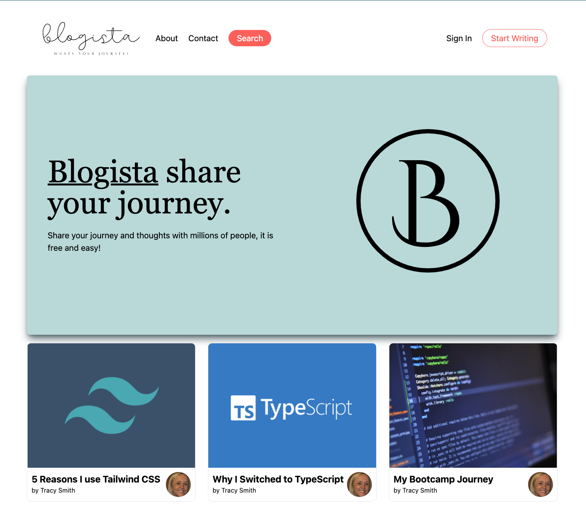

<div id="top"></div>

<!-- PROJECT LOGO -->
<br />
<div align="center">
  <a href="https://blogista.netlify.app/">
    
  </a>

  <h3 align="center">Blogista Full Stack Next JS App</h3>

  <p align="center">
    Find out more
    <br />
    <a href="https://github.com/tracysuzanne321/blogista"><strong>Explore the docs »</strong></a>
    <br />
    <br />
    <a href="https://blogista.netlify.app/">View Demo</a>
    ·
    <a href="https://github.com/tracysuzanne321/blogista/issues">Report Bug</a>
    ·
    <a href="https://github.com/tracysuzanne321/blogista/issues">Request Feature</a>
  </p>
</div>

<!-- TABLE OF CONTENTS -->
<details>
  <summary>Table of Contents</summary>
  <ol>
    <li>
      <a href="#about-the-project">About The Project</a>
      <ul>
        <li><a href="#built-with">Built With</a></li>
      </ul>
    </li>
    <li>
      <a href="#getting-started">Getting Started</a>
      <ul>
        <li><a href="#prerequisites">Prerequisites</a></li>
        <li><a href="#installation">Installation</a></li>
      </ul>
    </li>
  </ol>
</details>

<!-- ABOUT THE PROJECT -->

## About The Project

Blogista is a blog hosting application for professional and amateure writers to publish their work.
Blogista allows users to log into a secure personal account, upload and publish their writings for other users to view. It also allows the option for the work to be pay per view. Readers can follow and get updates on new publications from their favoutite writers.

<p align="right">(<a href="#top">back to top</a>)</p>

<div align="center">
  <a href="https://blogista.netlify.app/">
    
  </a>

### Built With

As well as developing full stack skills I was also keen to use Next.js to speed up page loading and optimise the caching of pages. I also wanted to develope my TypeScript skills to enable my applcation to be more stable. Here is the full list of the full tech stack

- [Next.js](https://nextjs.org/)
- [Sanity](https://www.sanity.io/)
- [TypeScript](https://www.typescriptlang.org/)
- [Node.js](https://nodejs.org/en/)
- [Tailwind CSS](https://tailwindcss.com/)

<p align="right">(<a href="#top">back to top</a>)</p>

<!-- GETTING STARTED -->

## Getting Started

This is a [Next.js](https://nextjs.org/) project bootstrapped with [`create-next-app`](https://github.com/vercel/next.js/tree/canary/packages/create-next-app).

## Available Scripts

First, run the development server:

```bash
npm run dev
# or
yarn dev
```

Open [http://localhost:3000](http://localhost:3000) with your browser to see the result.

## Learn More

To learn more about Next.js, take a look at the following resources:

- [Next.js Documentation](https://nextjs.org/docs) - learn about Next.js features and API.
- [Learn Next.js](https://nextjs.org/learn) - an interactive Next.js tutorial.

You can check out [the Next.js GitHub repository](https://github.com/vercel/next.js/) - your feedback and contributions are welcome!

### Installation

1. Clone the repo
   ```sh
   git clone https://github.com/tracysuzanne321/blogista
   ```
2. Install NPM packages
   ```sh
   npm install
   ```

<p align="right">(<a href="#top">back to top</a>)</p>

<!-- CONTRIBUTING -->

## Contributing

Contributions are what make the open source community such an amazing place to learn, inspire, and create. Any contributions you make are **greatly appreciated**.

If you have a suggestion that would make this better, please fork the repo and create a pull request. You can also simply open an issue with the tag "enhancement".
Don't forget to give the project a star! Thanks again!

1. Fork the Project
2. Create your Feature Branch (`git checkout -b feature/AmazingFeature`)
3. Commit your Changes (`git commit -m 'Add some AmazingFeature'`)
4. Push to the Branch (`git push origin feature/AmazingFeature`)
5. Open a Pull Request

<p align="right">(<a href="#top">back to top</a>)</p>

<!-- LICENSE -->

## License

Distributed under the MIT License. See `LICENSE.txt` for more information.

<p align="right">(<a href="#top">back to top</a>)</p>

<!-- CONTACT -->

## Contact

Email me at - tracysmith32@live.co.uk

Project Link: [https://github.com/tracysuzanne321/blogista](https://github.com/tracysuzanne321/blogista)

<p align="right">(<a href="#top">back to top</a>)</p>
